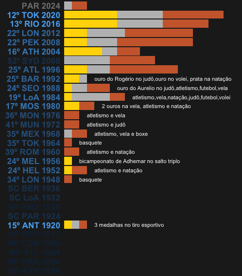
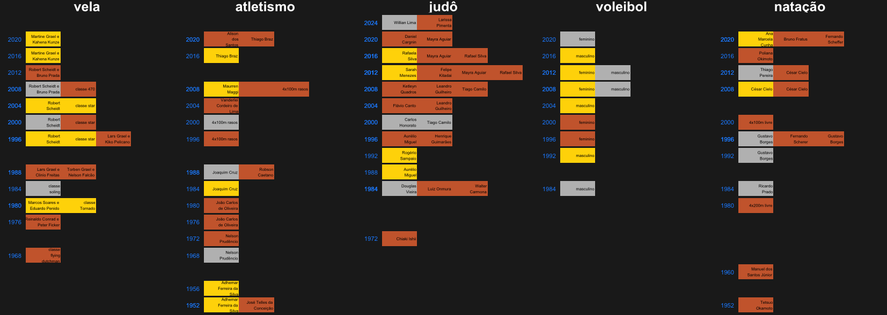

# Medalhas olímpicas do Brasil
História das conquistas olímpicas

A participação do Brasil na história dos Jogos Olímpicos é marcada por um crescimento gradual e significativo desde sua primeira aparição em 1920. O país iniciou sua trajetória olímpica com um pequeno grupo de atletas e ao longo das décadas aumentou seu contingente e a diversidade de esportes nos quais compete. Este desenvolvimento refletiu-se não apenas na quantidade de medalhas conquistadas, mas também na excelência em várias modalidades, consolidando o Brasil como uma nação com um forte espírito olímpico.

 

    

  Visualização feita com os dados da wikipedia em 
    <a href="https://pt.wikipedia.org/wiki/Lista_de_medalhas_brasileiras_nos_Jogos_Ol%C3%ADmpicos">
      https://pt.wikipedia.org/wiki/Lista_de_medalhas_brasileiras_nos_Jogos_Ol%C3%ADmpicos
    </a>

 

Entre os destaques da trajetória brasileira, o atleta Adhemar Ferreira da Silva brilhou ao conquistar o bicampeonato olímpico no salto triplo em 1952 e 1956. No campo dos esportes, a vela tem sido particularmente bem-sucedida, destacando-se com duas medalhas de ouro nos Jogos de 1980. O judô é outro esporte de grande destaque para o Brasil, sendo a modalidade que mais trouxe medalhas ao país ao longo dos anos. Por fim, o vôlei merece uma menção especial, com as seleções de vôlei de quadra conquistando quatro ouros consecutivos entre 2004 e 2016, firmando-se como uma potência mundial nesta modalidade.

 

    

 

